

  
# Alessandro Portfolio

### 2023-2026 Game Design & Development Graduate and Apiring Game Developer
 

<h1 align="center"> About </h1>

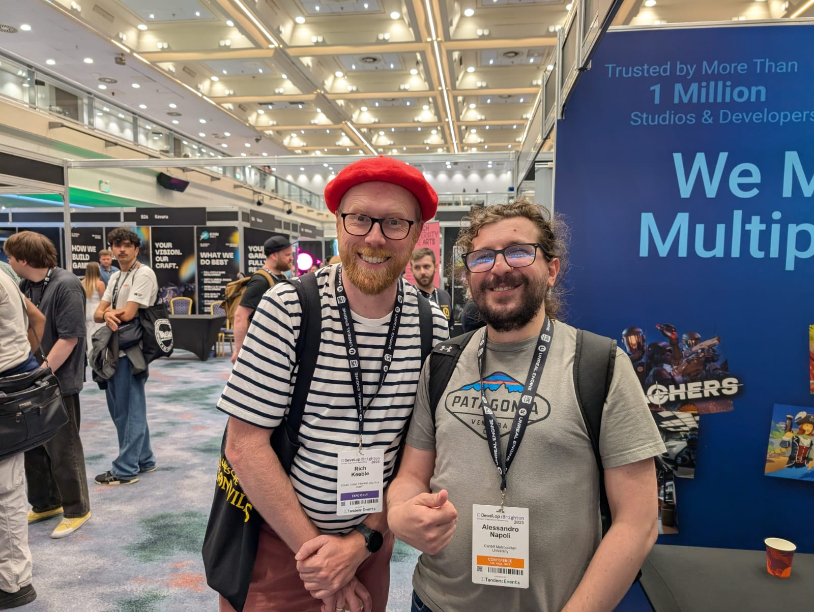

I am a Graduate in Computer Games Design and Development at Cardiff Metropolitan University interested in game mechanics and how to make them work in different kind of games. I have experience in C++ and C# using them in Unity and Unreal Engine but also in lower API. I have taken part in some cooperative events like the Global Game Jams and other organised by the university where I filled different roles, from designing UI to porting games in different platforms.
I am very curious about new ways to implements mechanics and I look foward for my new experiences.

 
 

<h1 align="center"> Contact Info</h1>

  <a href="mailto:axel9310@gmail.com">
    
  </a>
  
  axel9310@gmail.com

&nbsp;&nbsp;&nbsp;&nbsp;

 
 

<h1 align="center">Languages and Tools</h1>

<table width="100%">
<tr>
    <th width="33%">
Languages
</th>
    <th width="33%">
Game Engines
</th>
    <th width="33%">
Tools
</th>
  </tr>
    <tr>
    <td align="center" valign="top">
       
      
        
      
        
    </td>
<td align="center" valign="top">
       
      
        
      
        
    </td>
    <td align="center" valign="top">
       
      
      
      
        
    </td>
  </tr>
</table>

# Populous II Remake (VR/PC/Switch) (2026)
This project consistent on remaking the classic game Populous II from Bullfrog. It is developed in Unity and works across three different platforms (VR, Switch and PC). The main mechanics of the game are the manipulation of the terrain and the powers that the player can use.

  
  <table width="100%">
  <tr>
    <td width="33%" align="center">
      
    </td>
    <td width="33%" align="center">
      
    </td>
    <td width="33%" align="center">
      
    </td>
    <tr>
    <td width="33%" align="center">
      
    </td>
    <td width="33%" align="center">
      
    </td>
    <td width="33%" align="center">
      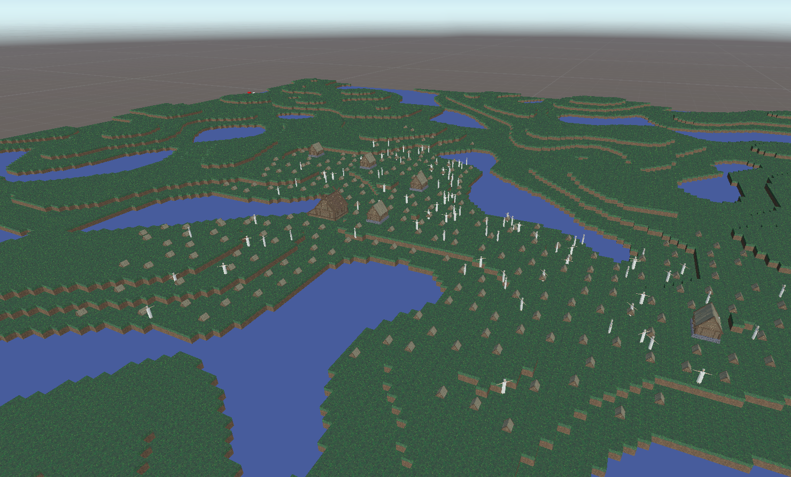
    </td>
  </tr>
  </tr>
  </table>

   

<h2 align="center">Contributions</h2>

<table>
  <tr>
    <th width="33%">
        
Multi Platform

    </th>
    <th width="33%">
        
UI and Power Logic

    </th>
    <th width="33%">
        
Scribtable Objects

    </th>
  </tr>
  <tr>
    <td valign="top">
      <ul>
        <li><b>XR Toolkit:</b> Utilised Unity's XR interaction toolkit to adapt mechanics into VR.</li>
        <li><b>Input Maps:</b> Using the new input system to make the input calls on scripts easier and suitable for multiple platform</li>
      </ul>
    </td>
    <td valign="top" >
      <ul>
         <li><b>Adapted UI:</b> UI specific for each platform. Screen space canvases for PC and Console, Attached to the XR controller for VR.</li>
         <li><b>Power Managers:</b> Power controlled by managers, where the mana the powers showed in the UI and the mask are decided in the back end. </li>
         <li><b>Designer Friendly:</b> The system is developed to be designer friendly where adding new powers into the UI is simple and built-in in editor. </li>
         <li><b>Specific Mana:</b> The mana system is tidied to the power system and will use the specific resource of the specific spell. </li>
      </ul>
    </td>
    <td valign="top">
      <ul>
        <li><b>Scriptable Objects:</b>  The Power system is being designed to be scalable so it uses scriptable object to share data between powers. </li>
        <li><b>In Editor Tools:</b> The powers are customisable in editor, change what you need from cooldown to icons and mana needed using the inspector. </li>
      </ul>
    </td>
  </tr>
</table>

 

 

**Tools used:** Unity, C# Scripting, Valve Index, Nintendo Switch Dev-Kit, GIT

 

# Fire simulation (Unity & Unreal 5)
 A fire propagation system was made as part of a different project, and then used on the populous remake as part of some fire power.
 The goal was to try and simulate realistic fire propagation through objects. Developed in Unity in a 6 weeks cycle and then tried to simulate the same effects in Unreal to state which engine will work best for this particular effect.

 

  
  <table width="100%">
  <tr>
    <td width="33%" align="center">
      
    </td>
    <td width="33%" align="center">
      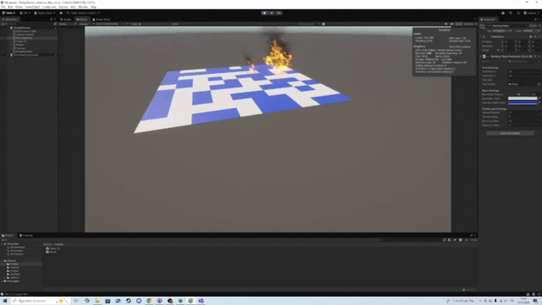
    </td>
    <td width="33%" align="center">
      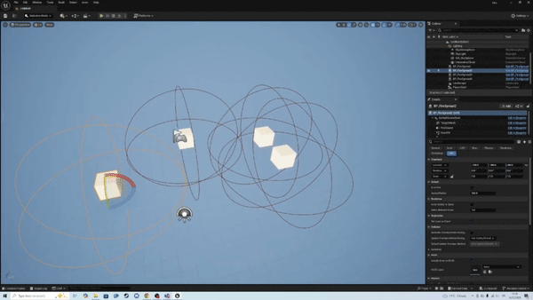
    </td>
   
  </tr>
  </tr>
  </table>

   

<h2 align="center">Key Feature</h2>

The tool is being made with scalability and portability in mind. It's easy to integrate in existing project with minimal change on the scripts and/or the object of the existing project.
Can be optimised using object pools for the fire (similar to what we did in populous).

 
 
 

# Behind the Lens (Unity)

  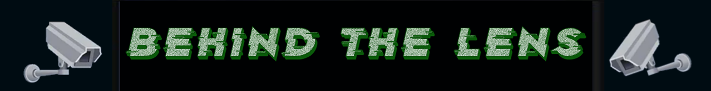

***Behind the Lens*** is a first-person escape room where players solve puzzles by controlling security cameras and remote-controlled devices across multiple rooms. Built in **Unity** as part of a collaborative team project utilising **Git** for version control.

  

  
  <table width="100%">
  <tr>
    <td width="33%" align="center">
      
    </td>
    <td width="33%" align="center">
      
    </td>
    <td width="33%" align="center">
      
    </td>
   
  </tr>
  </tr>
  </table>

   

<h2 align="center">Contributions</h2>

In this project I was more involved in the back end and UI effects for the cameras. I made a small tool for the other members of the team to make the 9 rooms without dragging all the objects and camera in the scene but by giving the position and objects to the tool.
For the UI I used a shader for the static effect of the camera and a global volume for the Night Vision.

 
 
 

# Sudoku Solver
This was another fast development project where I made a sudoku solver for different kind of sudoku. It's written in C++ and is able to solve sudoku of different sizes (6x6, 9x9, 12x12, 16x16), with different rules (Diagonal & extra regions) and, as part of this project, I wanted to explore Unity portability with DLL so I made it a DLL using this solver and import it in unity using a wrapper and a small script to make it work in Unity.

  

  
  <table width="100%">
  <tr>
    <td width="33%" align="center">
      
    </td>
    <td width="33%" align="center">
      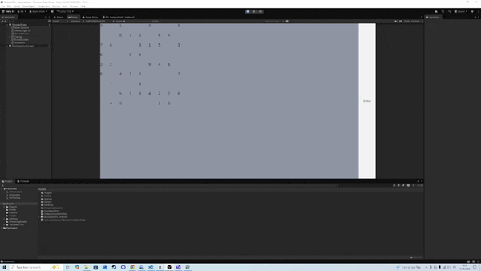
    </td>
    <td width="33%" align="center">
      
    </td>
   
  </tr>
  </tr>
  </table>

   

# Pitch and Play

Pitch and Play is my dissertation project where I made a sound detection game to help in educational music studies. It uses a third party fast fourier library to analyze the sound wave and then detect the accuracy of the note sang to move a platform to balance the ball. The project works on Android and PC.

  

  
  <table width="100%">
  <tr>
    <td width="33%" align="center">
      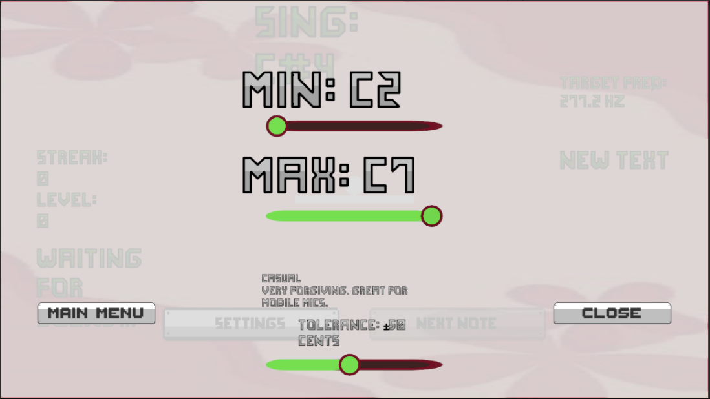
    </td>
    <td width="33%" align="center">
      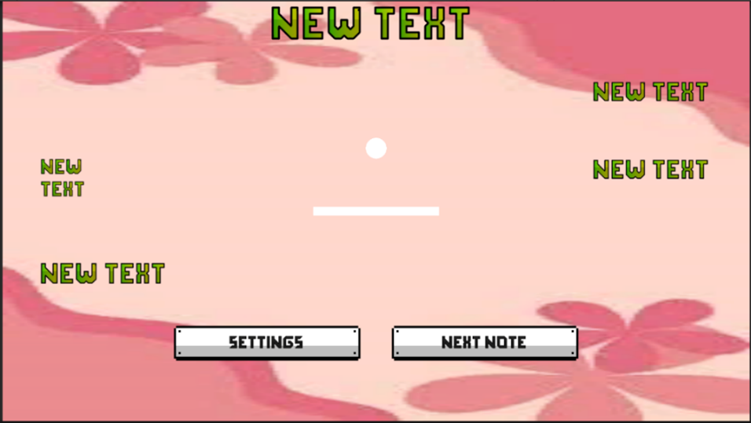
    </td>
    <td width="33%" align="center">
      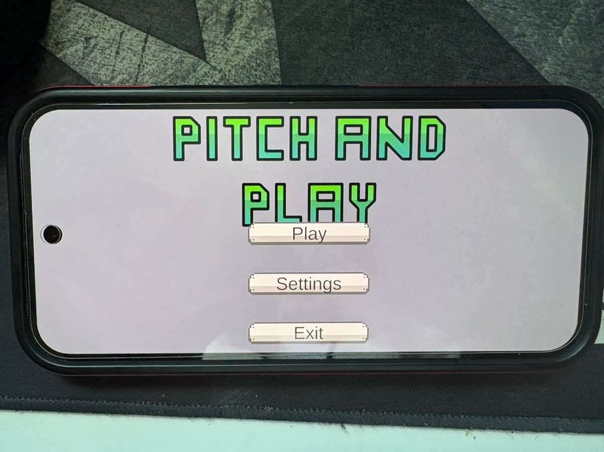
    </td>
   
  </tr>
  </tr>
  </table>

   

# Bizarre Bazaar (2026)

 

  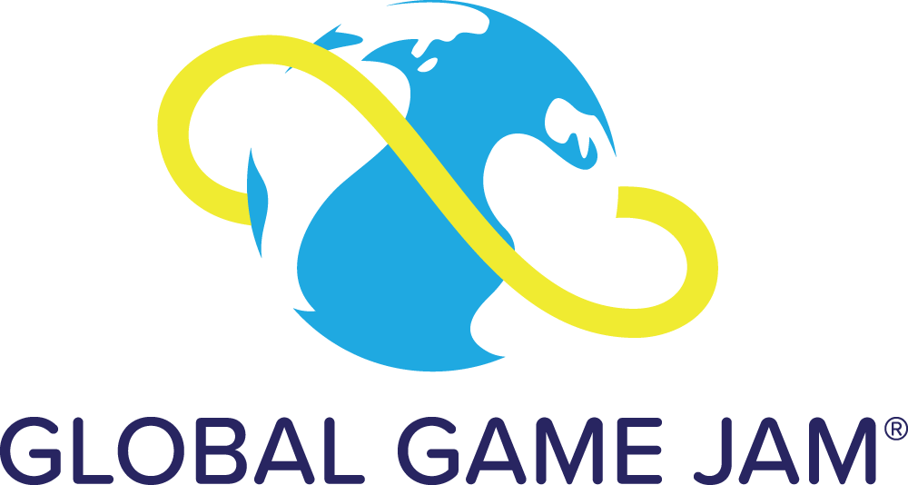

 
 

**Bizarre Bazaar** is set within a bustling market, somewhere in this market is your doppelganger. Find the helpful teleporting hint giver who will help you identify the doppelganger one attribute at a time before its too late.

This was developed as part of a seven person team within **Unity** for the *"Mask"* themed Global Game Jam 2026.

My contribution for this Jam was mainly the randomization of the people outfit and the math behind the possible combinations. Also the check that in every game there will be only one doppelganger.

<table width="100%">
  <tr>
    <td width="33%" align="center">
      
    </td>
    <td width="33%">
      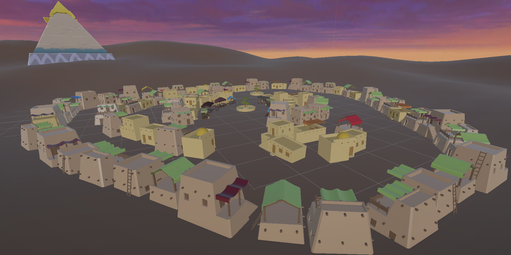
    </td>
    <td width="33%">
      
    </td>
  </tr>
</table>

 

  

**Engine and Tools :** Unity, C# Scripting, GIT

 

# Other Work (Smaller Projects)

Some smaller contributions and projects are not being included on this portfolio but I will be more than happy to talk about them!

