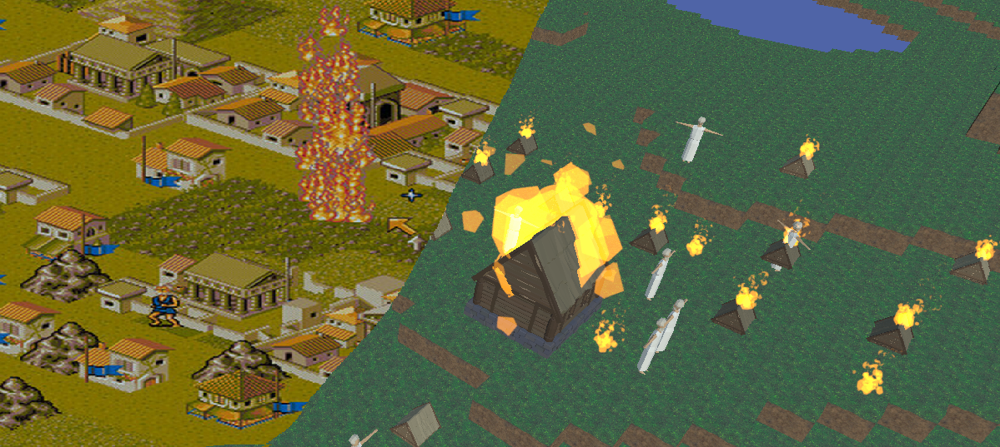
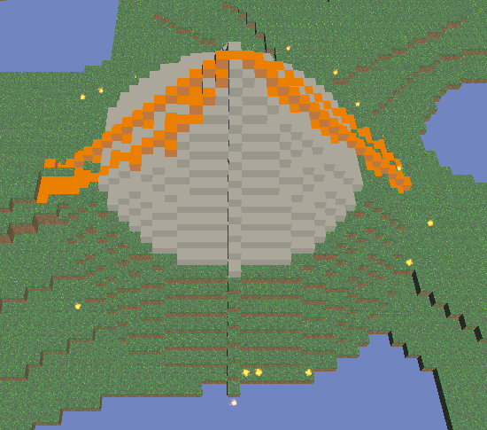
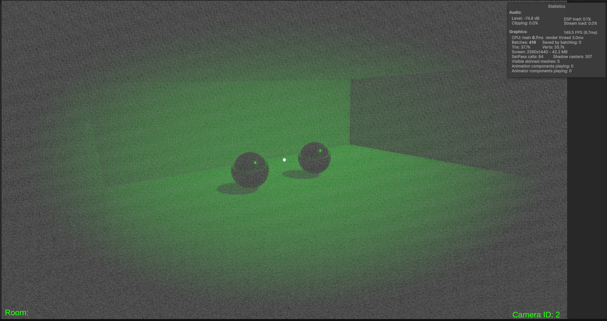
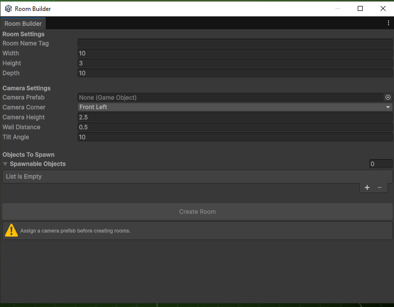

#  Alessandro Napoli
### *Game Developer • Technical Designer • Programmer*

<p align="center">
  
</p>

> *"Men Trip Not On Mountains; They Stumble Upon Stones."*

---
<br>

#  About Me

Welcome! I'm a passionate 1st class graduate student in Game Design and Development focused on creating engaging gameplay systems, polished mechanics, and memorable player experiences.

I have experience in C++ and C# using them in Unity and Unreal Engine but also in lower API. I have taken part in some team events like the GGJ and other jams organised by the university where I filled different roles, from UI implementation to cross platform porting.

I enjoy working with:

- Gameplay mechanics
- Tools Development
- Cross platform
- Automated tests
---
<br>

#  Featured Projects

---
<br>

# Populous II Remake

<p align="center">

</p>

**Genre:** God Game

**Engine:** Unity

**Platform:** PC, Switch, VR

### Description

A remake of the classic game Populous II from Bullfrog. It is being developed to work across the 3 platform, using the same input maps with different binding depending on the input system used (works with keyboard and mouse, gamepad, VR controller and the switch joycon).

### Features

- Terrain Manipulation
- God power customisable in editor
- NPC AI
- Interactive UI system for choosing and changing the powers
- Real time minimap

### Technologies

`C#` `Unity` `ScriptableObjects` `Input Maps` `UI Systems`

### Gallery

<p align="center">
  
  
</p>

<p align="center">
  
  
</p>

---
<br>

# Pitch and Play 

<p align="center">

</p>

**Genre:** Educational Game

**Engine:** Unity

**Platform:** PC, Mobile (Android)

### Description

Pitch and Play is my dissertation project where I made a sound detection game to help in educational music studies. It uses a third party fast fourier library to analyze the sound wave and then detect the accuracy of the note sang to move a platform to balance the ball. The project works on Android and PC.

### Features

- Real Time sound wave analysis
- Porting C++ libraries using DLL
- Incremental difficulties


### Technologies

`C++` `C#` `Visual Studio` `FFT` `DLL` `Android NDK`

### Gallery

<p align="center">
  
  
</p>

---

<br>

# Behind the Lens (Unity)
<p align="center">

</p>

**Genre:** Puzzle

**Engine:** Unity

**Platform:** PC

### Description
Behind the Lens is a first-person escape room where players solve puzzles by controlling security cameras and remote-controlled devices across multiple rooms. Built in Unity as part of a collaborative team project utilising Git for version control.

### Features

- UI effects (Global Volumes and shaders)
- Room generator tool
- Camera teleporting

### Technologies

`C#` `Visual Studio` `Shaders` `Global volumes` `Tool development`

### Gallery

<p align="center">
  
  
  
</p>

---

<br>

# 📂 Other Projects

| Project | Engine | Status |
|----------|--------|--------|
| Sudoku Solver| Unity, lower Api | Complete |
| Fire Spread Simulation| Unity, Unreal | Complete |
| Roguelike game| Unity | On going |

---
<br>

# 💻 Skills

## Programming

```
C#
C++
```

## Engines

- Unity
- Unreal Engine 


## Tools

- Git
- 3DS max
- Visual Studio

---
<br>

# Certifications

- 1st Class Degree in Computer Game Design and Development

---
<br>

# 🌐 Find Me

| Platform | Link |
|----------|------|
| 💻 GitHub | https://github.com/AxelG6|
| 💼 LinkedIn | https://www.linkedin.com/in/alessandro-nap |
| 📧 Email | axel9310@gmail.com |

---

# Thanks for Visiting!

Thank you for taking the time to visit my portfolio! If you want to have a deeper look in to the code or see smaller projects I worked on please don't hesitate to contact me!

```
      _____________
     /             \
    |   GAME OVER   |
    |               |
    |   Thanks for  |
    |   Playing!    |
     \_____________/
```

